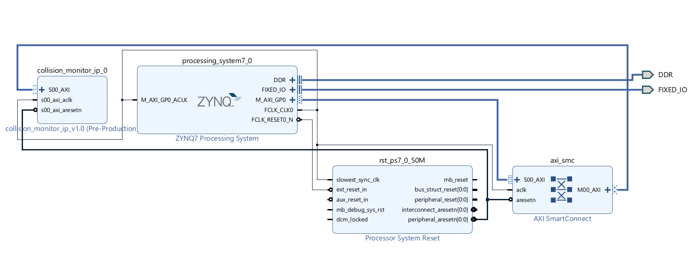

# zynq-collision-monitor

> **HW/SW Co-Simulation of a Radar Collision Monitor on Zynq-7000 SoC**
> Built entirely in simulation — no physical board required.

[](https://en.wikipedia.org/wiki/VHDL)
[](https://en.wikipedia.org/wiki/SystemVerilog)
[](https://www.xilinx.com/products/design-tools/vivado.html)

---

## How this project started

I was researching FPGAs during my semester break when I came across a YouTube video of a SawStop table saw — the kind that detects a finger touching the blade and slams the brake in milliseconds to avoid a serious injury. I kept thinking: *the same idea, but with a radar and a car.* A system that sees something coming too close and reacts, fast, in hardware.

I didn't have a Zynq board. So the project evolved into what I could actually do without hardware: build the full HW/SW pipeline in simulation, using the Zynq VIP to stand in for a real ARM processor. That constraint turned out to be the most interesting part.

I worked on it pretty much every day for about a week, morning to evening, during the break after my 1st semester — and kept coming back to it in the early weeks of the 2nd semester to extend and refine it.

---

## What the system does

Noisy radar distance data → filtered in VHDL on the PL side → a virtual ARM processor on the PS side reads the result over AXI4-Lite → an alarm fires when something gets too close.

```
┌─────────────────────────────────────────────────────────────────────────┐
│                         Zynq-7000 SoC (Simulated)                       │
│                                                                         │
│   ┌──────────────────────────────────────────────────────────────────┐  │
│   │             Processing System (PS) — Zynq VIP                    │  │
│   │           Virtual ARM, driven by the SystemVerilog testbench     │  │
│   │                    AXI4-Lite Master                              │  │
│   └─────────────────────────┬────────────────────────────────────────┘  │
│                             │ AXI4-Lite                                 │
│                    ┌────────▼──────────┐                                │
│                    │  AXI SmartConnect │                                │
│                    └────────┬──────────┘                                │
│                             │                                           │
│   ┌─────────────────────────▼────────────────────────────────────────┐  │
│   │           Programmable Logic (PL) — collision_monitor IP         │  │
│   │                                                                  │  │
│   │   slv_reg0 [0x00] ──► Moving Average Filter ──► Decision Guard   │  │
│   │   (Distance In)        (4-tap, ÷4 as >> 2)        (Alarm_o)      │  │
│   │                                                                  │  │
│   │   slv_reg1 [0x04] ◄── Alarm Status                               │  │
│   └──────────────────────────────────────────────────────────────────┘  │
└─────────────────────────────────────────────────────────────────────────┘
         ▲
         │ noisy_distance_data.txt
┌────────┴────────────┐
│   MATLAB Simulation │
│  Gaussian noise +   │
│  fixed-point quant. │
└─────────────────────┘
```



**AXI4-Lite register map**

| Offset | Register   | R/W | Description           |
|--------|------------|-----|-----------------------|
| `0x00` | `slv_reg0` | W   | Radar distance input  |
| `0x04` | `slv_reg1` | R   | Alarm output status   |

---

## Why this stack

**Why Zynq-7000?** I wanted to actually exercise the PS–PL path, not just write RTL in isolation. The Zynq was the first FPGA I knew of that has both sides on one chip, and it's common enough that documentation and examples are everywhere.

**Why AXI4-Lite (and not AXI-Stream or AXI-Full)?** My more experienced friend and mentor Atakan — an ARC researcher at ITU — suggested AXI4-Lite because it's the simplest AXI variant: single-beat, memory-mapped, no bursts. For a first SoC project, that was the right call. AXI-Full would have added complexity without teaching me anything the AXI-Lite version didn't.

**Why a 4-tap moving average filter?** I knew from my coursework that dividing by a power of two is basically free in hardware — you just bit-shift. So I picked `÷4` first, and the tap count followed (`>> 2` = divide by 4 = 4 taps). It's the dumbest possible filter, but it was a deliberate choice: the point of this project was the SoC integration and verification, not the DSP.

**Why MATLAB for stimulus?** We'd used MATLAB in my first-semester courses, so fixed-point quantization and Gaussian noise were one-liners I already knew how to write.

---

## Tools

| Layer         | Tool                          | Version        |
|---------------|-------------------------------|----------------|
| Data gen      | MATLAB                        | R2024a         |
| RTL           | VHDL (IEEE 1076-2008)         | —              |
| Testbench     | SystemVerilog                 | IEEE 1800      |
| SoC / IP pkg  | Xilinx Vivado                 | 2023.2         |
| VIP           | `processing_system7_vip_v1_0` | bundled        |
| Target device | Zynq-7000 (`xc7z020`)         | PYNQ-Z2 pinout |

---

## The bugs I hit

All four test phases pass now. Getting there took some work — here are the two bugs that actually made me learn something, each about an hour of head-scratching.

### Bug 1 — the alarm fires before anything happens

At `t=0`, the alarm was already on. No stimulus injected, nothing. Just a fresh simulation and the alarm screaming.

I spent the first chunk of debugging convinced my threshold logic was wrong. It wasn't. What was happening: when the AXI bus and registers initialize, `slv_reg0` comes up as `0x0000`. The filter reads this as "distance = 0 cm," which is obviously below the collision threshold, so the alarm fires immediately — before any real data has even been sent.

I thought about two fixes:

- **(a)** Add a "data valid" flag in VHDL and gate the alarm on it.
- **(b)** Initialize the filter pipeline to a safe value (`(others => '1')` = max distance) and wait for the AXI bus to settle in the testbench before driving anything.

I went with (b). Option (a) is cleaner in a real product, but for this project it would have meant adding a whole state bit for a condition that only exists at `t=0`. In VHDL:

```vhdl
signal stage : unsigned_array := (others => (others => '1'));
```

And in the SystemVerilog testbench, a short wait before the first write:

```systemverilog
#200ns;  // let the AXI bus reset and the filter warm up
```

False alarm gone.

### Bug 2 — negative distance reads as "totally safe"

While validating the MATLAB output, I noticed something weird: every once in a while the filter would report a massive distance — like `0xFFFF` — even when the sensor value was small. That's the opposite of dangerous. That's "safest possible."

The Gaussian noise was occasionally producing negative distance values (physically nonsense, numerically real). When those negatives were cast to unsigned 16-bit, two's complement kicked in: `-1` became `0xFFFF`. The filter then dutifully passed this along as a huge, reassuring distance.

I could have fixed it in VHDL by adding a check on the input path. But that costs a comparator on every clock cycle forever, to catch something that only happens in the stimulus. One line in MATLAB — clamping negatives to zero before quantization — solved it permanently and cost nothing at runtime. That felt like the right layer.

### Test results

| Phase | Input                            | Expected            | Result |
|-------|----------------------------------|---------------------|--------|
| 1     | Reset & warm-up                  | `Alarm=0`           | ✓      |
| 2     | Safe distances (3000, 4000, 5000)| `Alarm=0`           | ✓      |
| 3     | Exact threshold value            | `Alarm=0` (`<`, not `<=`) | ✓  |
| 4     | Danger (1500) → Recovery (3141)  | `Alarm=1` → `Alarm=0` | ✓    |


A single simulation run captures all four phases:

- **Phase 1 (~0–1 µs):** `alarm_o` is high from t=0 because the filter initializes to zero — the warm-up bug described above. Once the filter settles, the alarm drops.
- **Phase 2 (~1–4.8 µs):** Safe distances (3141, 3000, 4000, 5000) are injected via AXI writes. `alarm_o` stays at 0 throughout.
- **Phase 3 (~4.8–5.3 µs):** Distance is driven to exactly 2000 (the threshold). `alarm_o` stays at 0, confirming the comparator uses `<`, not `<=`.
- **Phase 4 (~5.3–7 µs):** Distance drops to 1500 — `alarm_o` fires, and `read_val` flips from `0x00000000` to `0x00000001` on the AXI read. Then 3141 is injected and the alarm clears cleanly.

### Resource utilization

### Resource utilization

Post-synthesis utilization for `collision_monitor_ip` (out-of-context) on `xc7z020`:

| Resource | Used | Available | Utilization |
|----------|------|-----------|-------------|
| LUT      | 105  | 53 200    | 0.20%       |
| FF       | 174  | 106 400   | 0.16%       |
| **DSP**  | **0**| 220       | **0.00%**   |
| BRAM     | 0    | 140       | 0.00%       |

The `÷4` in the moving average filter is written as `>> 2`, which Vivado maps to wiring — no logic cost. The `0` in the DSP row is the whole point: a naive `/4` would have inferred a DSP slice for a division that doesn't need one. The FF count breaks down roughly as 64 for the two 32-bit AXI registers, 64 for the 4-tap 16-bit shift register in the filter, and the rest for control logic.

---

## File structure

```
zynq-collision-monitor/
├── matlab/
│   └── noisy_distance_generator.m
├── rtl/
│   ├── collision_monitor.vhd           # Top module (AXI wrapper)
│   ├── moving_average_filter.vhd       # 4-tap, ÷4 as bit-shift
│   └── decision_guard.vhd              # Threshold comparator
├── sim/
│   ├── tb_sensor_reader.vhd            # Offline RTL testbench
│   └── tb_zynq_vip.sv                  # Full SoC simulation with Zynq VIP
├── vivado/
│   ├── ip/                             # Packaged AXI4-Lite IP
│   └── block_design/
├── data/
│   ├── noisy_distance_data.txt
│   └── hw_results.txt
└── README.md
```

---

## How to run

### 1. Generate stimulus

```matlab
cd matlab
run noisy_distance_generator.m
% Output: ../data/noisy_distance_data.txt
```

### 2. Offline RTL testbench (fast sanity check)

Open `sim/tb_sensor_reader.vhd` in the Vivado Simulator. Make sure `data/noisy_distance_data.txt` is reachable from the sim working directory. Results log to `data/hw_results.txt`.

### 3. Full SoC simulation with Zynq VIP

1. Open the Vivado project at `vivado/block_design/`.
2. Confirm `collision_monitor_v1_0` resolves from `vivado/ip/`.
3. Set `sim/tb_zynq_vip.sv` as the top simulation source.
4. Run the behavioral simulation. The Tcl console prints:

```
TEST 1 - Power-on reset & warm-up
TEST 2 - Nominal case (safe distances)
TEST 3 - Boundary / corner case
TEST 4 - Danger & Recovery sequence
SUCCESS: System fully recovered from danger state.
```

No hardware, no Vitis, no SDK needed.

---

## What I learned

**My bugs weren't where I thought they were.** Both times I first assumed the RTL was broken, and both times the RTL was fine — the stimulus around it wasn't. That's a lesson I'll carry: if the logic looks right on paper, question the testbench before you question the design.

**Pick the layer you fix the bug in.** Bug 2 was fixable in MATLAB, in VHDL, or in the testbench. All three "work." Only one is cheap forever. That kind of choice isn't a detail — it's the actual engineering.

**`>> 2` is not the same thing as `/ 4`.** I understood that as a fact from coursework. Writing the filter and then looking at what Vivado synthesized made it feel true for the first time.

**Know when to ask.** The AXI4-Lite choice, some of the verification methodology — I got there faster because I had Atakan to ask. Trying to reinvent everything from scratch would have cost me weeks, not hours.

---

## Limitations & what I'd do next

| Area | Now | Next |
|------|-----|------|
| Filter | 4-tap moving average | A real IIR, generated via MATLAB HDL Coder |
| Transport | AXI4-Lite | AXI-Stream for continuous sensor data |
| Validation | Simulation only | Hardware bring-up on a PYNQ-Z2 or Zybo when I can get my hands on one |

The `.xsa` is exported and ready for Vitis the moment I have a real board.

---

## Acknowledgments

Thanks to **Atakan Beyen**, ARC researcher at ITU, who mentored me through the SystemVerilog and AXI side of this project. A lot of what I learned about verification methodology came out of conversations with him.

---

## Context

Built as a self-directed project that started in the break after my 1st semester of Electrical and Computer Engineering and continued into the early weeks of the 2nd semester. The goal wasn't to build a working radar — it was to understand how an FPGA-based system is actually designed and verified, end to end, and to do it without waiting for a board to arrive.

Inspired by a [SawStop](https://www.sawstop.com/) demo video. Different domain, same idea: see the danger, stop in hardware.
